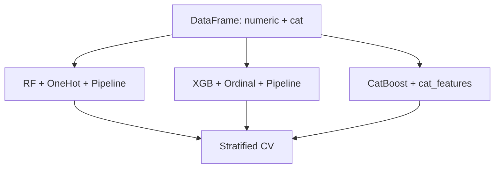

# Categorical Boost Lab

[](https://github.com/milos-plavsic/categorical-boost-lab/actions/workflows/ci.yml)
[](https://www.python.org/downloads/)

Advanced tabular benchmark where **numeric and high-cardinality categorical** features coexist. Compares:

- **Random Forest** with **One-Hot Encoding** (sparse-friendly tree splits)
- **XGBoost** with **ordinal encoding** for categoricals (standard tree boosting baseline)
- **CatBoost** with **native categorical handling** (ordered boosting, no manual explosion)

Same stratified folds and ROC-AUC for fair comparison.

## Quickstart

```bash
python3 -m venv .venv && source .venv/bin/activate
make install
make run
make test
make api
```

## Architecture



## API

- `GET /health`
- `POST /v1/compare` — JSON `{"n_samples": 1200, "cv_splits": 3}`

## Why recruiters care

- You are not “default `fit` on a CSV” — you show **encoding choices** matched to **model families**.
- CatBoost’s categorical treatment vs XGBoost preprocessing is a common **real interview topic**.

## License

MIT
